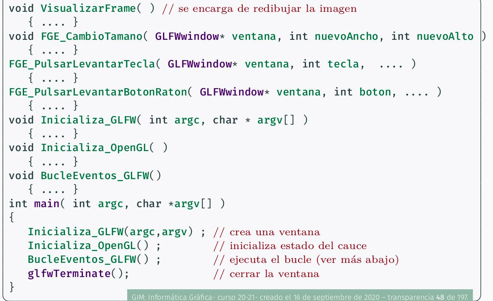
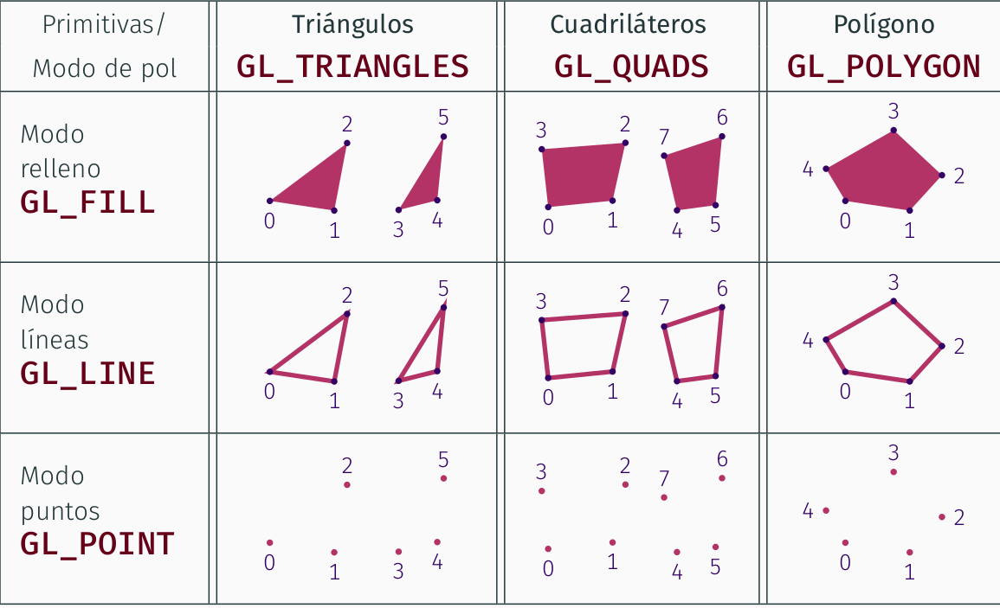
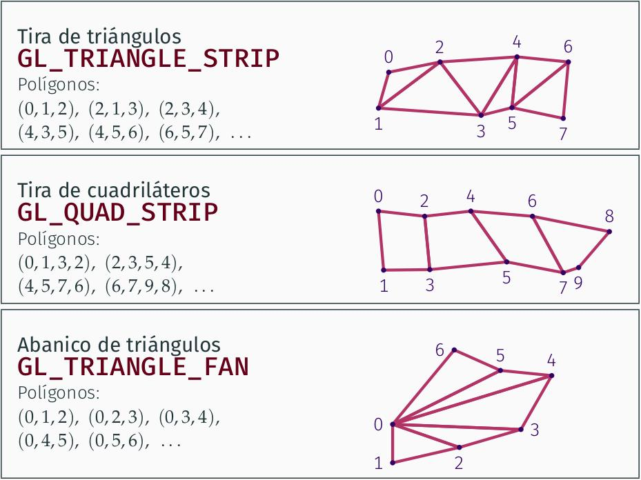
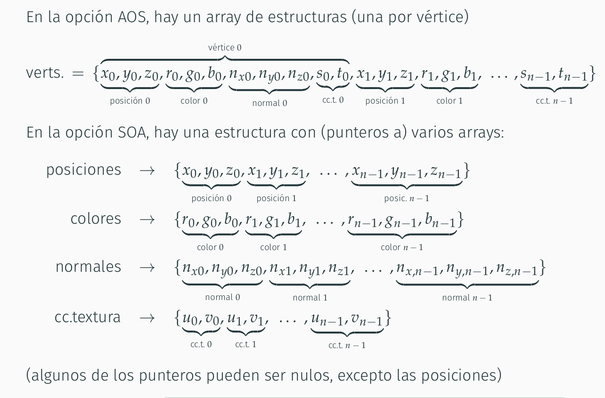

# Tema 1:
## Sección 2: Proceso de visualización  
- Dos algoritmos para visualizar imágenes: rasterización y ray-tracing 
- __Programa gráfico__ --> almacena ED con modelo --> Salida: imagen
- __Imágenes Raster:__ array de pixeles por filas y columnas y cada pixel tiene un color RGB  
- __Imágenes vectoriales:__ archivos.svg. La información se codifica a un nivel más alto.
    - Una img vect tiene lista de segmentos o curvas con una serie de parámetros numéricos.
- __Interactive Grafic Program__ --> Visualiza una imagen que responde a eventos (acciones del usuario) --> Timepos de espera de ms
- __Non-Interactive Grafic Program:__ Modelo --> Salidas: imágenes con duración s<-->horas  
- __Proceso de visualización:__ producir una imagen a partir del Modelo de escena y parámetros
    - Modelo Escena: ED
        - Modelo geométrico: primitivas, modelos de frontera, representacion de la forma de objetos con poligonales.
        - Modelo de aspecto: Parámetros que definen el aspecto de objetos.  
    - Parámeeros de visualización: parámetros para ver donde está la cámara:
        - Cámara Virtual: posición, ángulo de visión y orientación  
        - Viewport: Resolución y posición de la imagen en la ventana

### Algoritmos: Rasterización y Ray-tracing  

- Rasterización:
    - Primitiva: elementos más pequeños que pueden ver visualizados. Punto, segmento, etc.
    - Complejidad: O(n*p)
    - Las GPUs con el hardware diseñado especialmente para este algoritmo.
    - Más eficiente que el Ray-Tracing
~~~
Inicializar el color de todos los pixeles
for each Primitiva,P del modelo a visualizar
    Encontrar el conjunto S de pixels cubiertos por P
    For each pixels q de S:
        Calcular el color de P en q
        actualizr el color de q
~~~  

- Ray-Tracing
    - Complejidad: O(p*log(n))
    - No se usa en 2D, pero sí en 3D
    - Consideramos todas las primitivas en todos los pixeles
~~~
Inicializar el color de todos los pixeles
For each pixel q de la imagen a producir
    Calcualr T, el conjunto de primitivas que cubren q (Método: Indexación espacial)
    para cada primitiva P del conjunto T
        Calcualr el color de P en q
        actualizra el color de q
~~~  
    - La diferencia en los dos está en que se intercambian los bucles, se hace el mismo cálculo pero en diferente orden.   
    - No se usa en videojuegos por ser menos eficiente que lo otro. 
    - Se usa en producción de películas
    - Dan realismo 

- __Cauce gráfico:__ conjunto de etapas
    - Entradas (inputs): Primitivas --> (triangulos, segmentos de líneas o puntos)   
        - Vértice: punto en el espacio 2D o 3D. Una o varias primitvas se representan con una lista de coordenadas de vértices, más alguna información adicional.
        - Framebuffer: zona de memoria en la GPU donde están los colores de los pixeles de la imagen que se está viendo en pantalla. 
    - Etapas de Calculo:
        - Transformación y proyección de primitivas.  
            - Proyección: perspectiva o paralela

### Las APIs de rasterización 
La escritura en el Framebuffer es lenta y se realiza pixel a pixel, ya que cada operación de acceso al buffer es lenta. Usando una API conseguimos separar la implementación del hardware, permitiendo portabilidad y acceso simultáneio.  
Hoy en día se usan GPU, Unidad de Procesamiento Gráfico con chips con unidades de operaciones en coma flotante, unidades de control, etc y que pueden trabajar en paralelo. Con capaces de implementar el cauce de rasterización con buena eficiencia.

APIs de rastericación:  
- OpenGL
    - OpenGL ES
    - WebGS
- DirectX
- Metal
- DirectX12
- Vulkan

El cauce gráfico tiene las siguiente etápas:  
- Procesado de vértices:
  - Transformación
  - Teselación y nivel de detalle
- Post-proceso de vértices y montaje de primitivas
- Rasterización
- Sombreado
## Sección 3: La librería OpenGL.- Visualización
- OpenGL: para visualizar 2D y 3D
  - GLFW: para gestión de ventanas y eventos de entrada  

### Programación y eventosd en GLFW  
- Eventos:
  - Teclado
  - Ratón
  - Cambio de tamaño 
- Funciones Gestoras de Eventos, FGE: son invocadas uando ocurre algún eventgo de algún tipo 

Estructura de un programa:
- Variables, ED, variables globales
- Código de las funcioens gestoras de evento
- Código de inicialización
  - Creación y configuración de las ventanas donde se visualizan las primitivas
  - Establecimiento de las funciones del programa que actuarán como gestoras de eventos
  - Configuración inicial de OpenGL
- Función de viusalización de un frame o cuadro
- Bucle principal     
   

### Tipos de primitivas
- Primitiva: punto, segmento o polígono que generalmente son triángulos. 
- Con una lista de n coordenadas se puede codificar:
  - puntos aislados
  - segmentos de recta
  - triangulos 
  - cuadriláteros
  - polígono
  - tira de triángulos
  - abanico de triángulos
  - tira de cuadriláteros
- En OpenGL se definen varias constante de tipo __GLenum__ para identificar los distintos tipos de primitivas (puntos y segmento):
  - GL_POINTS
  - GL_LINES
  - GL_LINE_STRIP (polilínea abierta)
  - GL_LINE_LOOP  (polilínea cerrada)
- Primitivas tipo polígono:

 
  

- Los polígonos se pueden visualizar como:  
  - Puntos  
  - Líneas (polilínea cerrada)
  - Relleno 
- Polígonos con más de tres vértices
  - Deben tener todos sus vértices en el mismo plano 
  - No se deben intersecar las aristas  
  - Deben ser convexos
- Problema de vértices replicados: se repiten coordenadas
  - Solución: Secuencias indexadas
    - Vn --> Secuencia con los vértices
    - Im --> secuencia de índices (enteros) que dicta la unión de puntos de Vn  

__IMPORTANTE__: no confundir la constante __GL_Line__ con __GL_Lines__
### Atributos de vértices   
- **Coordenadas de su posición**
- **color**: vector terna RGB entre 0 y 1, con posible valor de transparencia
- **Normal**: vector que determina la orientación (para iluminacion), tres posiciones  
- **Coordenadas de textura:** se usan imágenes en vez de colores 
- **Valores:**
  - Todo vertice --> (posicion,color,normal,coord_textura)  
- A **cada vértice** siempre se le asocia una tupla por cada atributo:
  - Todo vértice tiene asociado una posición, un color, una normal y unas coordenadas de texturas que se usarán o no. 

### Modos de envío  
Si queremos visualizar la secuencia de vertices o atributos:  
- **Modo inmediato**
  - Una llamada por vértice y atributo:
    - Lento
    - Cordenadas y atributos vértice a vértice
  - Una llamada para varios vérties con todos sus atributos
  - No almacena coordenadas, por tanto, para visualizar más de una vez es necesario enviar las mismas coordenadas cad vez  
- **Modo diferido:**
  - Una única llamda, previamente trasladar las cosas de la RAM a la GPU
  - Reservar memoria en la GPU  
  - Se indica que se deben primero leer la GPU en vez de la RAM

### Almacenamiento de vértices y atributos  
- **Array de estructuras (AOS):**
  - Array o vector  
  - Cada entrada tiene:
    - Coordenadas de sus vertices
    - Atributos
- **Estructura de Arrays (SOA):**
  - Estructura con punteros a arrays 
  - Los arrays contienen:
    - uno para coordenadas
    - otros para los atributos tales como colores, normalex, texturas, etc
    - Echarle un ojo a lo de los descriptores de la tabla

------------------------------------------------- 
- Vertex Array Objects:   
      - Estructura de datos    
      - Para modo diferido:  
        - Crea tantos VAOs como sean necesarios  
      - Para modo inmediato:  
        - guarda un único VAO 
### Datos sobre secuencias de vértices
Para **visualizar** necesitamos conocer:
- Localización en memoria y formato de la tabla de coordenadas
- Para cada tabla de atriutos y para la tabla de índices
  - Un booleano para saber si se usa o no la tabla
    - si True =>localización en memoria y formato de la tabla  
Si se envía en:
- Modo inmediato: hacerlo para cada viusalización
- Diferido: enviar una vez y reusar la información para visualizarlo muchas veces   

### Vertex Array Objects (VAOs) de OpenGL
ED que contiene información sobre una secuencia de vértices:
- En el modo **inmediato**:
  - se Guarda un único VAO
  - Actualizar VAO antes de visualziar una nueva secuencia de vertices 
- En el modo **diferido**:
  - Hay tantos VAOs como sean necesarios
  - Cada VAO tiene un entero único asocaido (nombre dle VAO)
  - Por defecto está el VAO = 0
La aplicación necesita únicamente el identificador del VAO (nombre_vao) y cada tabla referenciada en un VAO debe estar en la GPU

FALTAN ALGUNAS COSILLAS 
  
### Envío de vértices y atributos  

Las coordenadas se pueden enviar de tres formas:
- Llamada a **glVertex** 
  - Una llamada por vértice
  - Poner en mitad de **glBegin** y **glEnd**
    - **glVertex3f** admite tres valores reales del tipo GLfloat
    - En la llamada a **glBegin** se indica como parámetro que tupos de primitivas se queiren construir con la secuencia
- Única llamada a:
  - **glDrawArrays** (secuencias no indexadas)
  - **glDrawElements** (secuencia indexada)
    - Requiere almacenar las seucencias de coordenadas, atributos e índices en un array en la memoria RAM
    - OpenGL recibe la dirección del array y lee todas las coordenadas

    

- Para enviar atributos usamos las funciones:  
  - **glColor3f**
  - **glNormal**
  - **glTexCoord2f**  

Para enviar vertices
~~~C++
std::vector<float> coords;
...
...
glBegin( tipo_prim );
for(int i = 0 ; i z coords.size()/3 ; i++)
  glVertex3f (coords[3*i+0],coords[3*i+1],coords[3*i+2]);
glEnd();
~~~
HAY MÁS VERTIENTES DE LA FAMILIA glVertex  

### Visualización y parámetros
- **glPolygonMode(GL_FRONT_AND_BACK, nuevo_modo)**: cambia el modo de visualización de polígonos.
  - Por defecto, __GL_GILL__
  - **nuevo_modo** es de tipo **GLenum**
- ---
- Para los errores, declaramos una macro  
  - Si hay mucho código, se pone una en principio y otra al final
    - Si da error al final, ponemos una en medo a ver que tal 

- **glViewport:** De todos los pixeles de la ventana, en cuales vamos a dibujar (rasterizar)
  - La función se llama en la __FGE_CambiaTamano__
- Inicialmente, OpenGL usa una proyección paralela al eje Z.  
- 

## Sección 4: Programación básica del Cauce
En la practicas esto no lo haremos 
### Cauce Gráfico. Tipos. Shaders.  
- **Transformación:** 
- **Sombreado:**
  - Shaders:
      - Procesador de vértices (vertex shader)
      - Procesador de fragmentos (pixeles) (fragment shader)  
- **Tipos de cauce gŕafico:**  
  - **Cauce de funcionalidad fija**
    - shaders predefinidos en OpenGL
  - **Cauce programable**
    - Se programan los shaders; Se compilan y enlazan en tiempo de ejecución; más flexible y eficiente

## Sección 5: Apéndice matemático  

- Transformaciones afín o transformaciones lineales:
  - Transformacioens que conservan lineas rectas y conservan el paralelismo

# Tema2:  

### Modelos geométricos formales
- __Modelo geométrico:__ modelo matemático para representar un objeto geométrico que existe en un espacio afín.
  - Los más genrales son los subconjuntos de puntos, como una esfera
- __Modelo basado n subconuntos de puntos:__
  - Permite representar cualquier objeto
  - No se puede representar en la memoria de un pc
    - Como solución se usan: __Modelos geométricos computacionales:__
      - __Ennumeración espacial:__ (voxels)
      - __Modelos de fronteras:__  (caras)

### Modelos de frontera  
- __Mallas de polígonos:__ conjunto de puntos de un espacio afín que forman caras planas, usualmente adyacentes entre ellas y que aproxima la forntera de un objeto en el espacio 3D.  
- __Objeto:__  Conjunto de puntos
- __Cara:__ conjunto de puntos en un plano delimitados por un polígono
- __Mallas:__ aproxima una superficie
  - Encierra completamente una región del espacio, el objeto tiene volumen  __(mallas cerradas)__
    - Pueden tener cualquier género topológico (el #huecos)
  - Constituye en sí misma el objeto que tiene volumen nulo __(mallas abiertas)__
    - Pueden tener huecos entre ellas  

- __Elementos de las mallas:__ 
  - __Vértices:__ par formado por un punto y un valor entero único
    - Punto -> posición del vertices
    - Entero -> Índice del vertice 
      - permite expresar la topología de una malla 
      - facilita construir representacioens computacionales de las mallas 
      - Dos vértices con distinto índice pueden tener la misma posición
  - __Caras:__ contiene conjunto de puntos coplanares que están delimitados por un único polígono plano. Se determinal por una seccuencia ordenada de índices de vérticces que forman dicho polígono 
    - En la secuenci de índices, cad vertice comparte una arista con el siguiente
    - Dos caras distitnas no pueden tneerr asocaido el mismo conjunto de indices, nni siquiera con distinto orden
  - __Arista:__ conjunto de puntos que van desde un lado a otro
    - los dos índices de vice de una arista no pueden coincidir
    - El orden en el que aparecen los índices en el par es irrelevantes
    - Dos aristas distintas no pueden tener el mismo par de índices   
    - 
- Una __Malla:__ viene determinada:
  - Secuencia de posiciones de ssus n vérties
  - Seccuencia de caras, cada una de ellas representada como una secuenci de k índices  de vértice
- __Relaciones de adyacencia:__ s pueden expresar en términos de los índices de los vértices puesto que los vértices están numerados 
- Una malla tiene una geometría y una topología  
- __Características de las 2-variedades__
  - Un vértice es adyacente a dos arsitas como mínimo
  - Una arista siempre es adyacente a una o a dos caras
  - Todas las caras adyacentes a un vértice se pued ordenar en una secuencia en la cual cada cara es adyacente a la sigueinte 
-Se puede modificar una malla para que sea una 2-variedad

__Orientación coherente de vértices en cada cara:__
- Caras adyacentes--> enumeración de los vértices en el mismo sentido
- Una malla cerrad--> cara vista desde el exterior rpesenta sus vértices en sentido anti-horarios
- Malla cerrada:--> una cara se ve en cada sentido

__ATRIBUTOS DE LA MALLA: NORMALES:__
- Normales: vetores de longitud unidad:
  - __normales de caras:__ vector unitario perpendicular a cada cara, apuntando al exterior de la malla si es una malla cerrada
    - Útiles cuando el objeto que se modela con la malla está realmente compuesto de caras planas o cuando se quiere hacer sombreado plano o bien cuando se quiere hacer sombreado plano.
    - Tienen sentido cuando la malla aproxima una superficcie crvada
  - __normales de vertices:__ lo mismo pero con los vértices 
  - __FPROBLEMA: DISCONTINUIDAD DE LA NORMAL__: Algunos objetas presentan aristas o vértices donde la normal es discontinua, en ese caso promediar normales es mala idea, y es necesario replicar cértices y arsitas 
__ATRIBUTOS DE LA MALLA: Colores:__
- Colores: Ternas RGB con valores entre 0 y 1
  - __colores de caras:__
  - __colores de vértices:__ color de la superficie en cada vértice
- Hay más atributos

### 3. Representación en memoria de modelos de fronteras
- __FORMAS DE REPRESENTAR LAS MALLAS EN LA MEMORIA DE ORDENADOR:__
  - __Triángulos aislados, tiras de tríangulos:__ no representan explícitamente la topología
  - __Mallas indexadas:__ lo más común, representan explícitamente la topología.
  - __Aristas aladas:__ extensión de las mallas indexadas para eficiencia en tiempo

### 3.1 Triangulos aislados  
- Lista o tabla de tríangulos aislados
- Vector o lista con tres entradas (tiplo Tupla3f) para cada triangulo
- Para cada triángulo se almacena als coordenadas locales de cada uno de sus tres vértices (9 valores flotante en total)
- La tabla se puede almacenar en memoria con todas las coordenadas contiguas
- En total, incluye 9n valores flotante
- Representación poco eficiente en tiempo y memoria
- No hay información explicita sobre la topología de la malla
### 3.2 Tiras de triangulos
- Pretende reducir la memoria y el tiempo que neceista la representación de triángulos aislados
  - Se reduce el número de vees que aparece replicadas las coordenadas
- Inconvenientes:
    - No evita totalfmente las redundancias
    - No incluye información explícita sobre la topología de la malla
    - Representación compleja
    - Necesidad de algoritmos
- Una malla es una estructura con varias tira. La tira número __I__ ( con ni triangulos) es un arrai con ni + 2 celdas, en cada una están las coordenadas maestras de un vértice
### 3.3 Mallas indexadas
Una ED que contiene información sobre una maya de triángulos en 3d. 

- Tabla de vertices: Entrada por vértice
- Tabla de triáungos: Ińdice del vértice
Ventajas:
  - No se repiten coordenadas de vértices:
  - Hay información explícita de la topología
   
### 3.4 Representación con estructuras de aristas aladas  
- El problema de las mallas indexadas es que la conulta de adyacencia puede ser costosa ==> Sol: aristas aladas  
- Las aristas aladas son para mallas que encierran un volumen, es decir, siemrpe hay dos caras adyaccentes a una arista. 
- Las consultas sobre adyacencia de arista-vertice y arista-triangulo pasan a tener un coste de O(1)
- Una malla se puede codificar usando una tabla de vértices (tver) mas una tabla de aristas (tari).:
  - Entrada por cada arista con dos índices:
    - vi = índice de vértice inicial
    - vf = índice de vértice final
  - También tiene:
    - ti = índice de triángulo a la izquierda
    - td = indice de triángulo a la derecha
- Con lo anterior permitimos consultas sobre adyaccenccia entre arista-vértice y arista-triángulo en tiempo O(1)
- Una arista tiene aociados un chorro de índices 

## Sección 4: Transformaciones geométricas

### Concepto de transformación Geométrica
- Marco de coordenadas de la escena o marco de coordenadas del mundo 
- Las coordenadas de los vérties repecto de dicho sistema de referencia se llaman coordenadas del mundo
- Esto permite separar la definición de los objetos, de su usu en una escena concreto.
- __TRANSFORMACIONES GEOMÉTRICAS__
  - Hay que calcular las coordeandas del mundo a pasrtir de las coordenadas locales o maestras
    - Transformaciones afines 
      - Rotaicones
      - Traslaciones
      - Escalado (uniforme y no unifirme)
      - Cizallas
###

###

### Transformaciones ne OoenGL con cle cauce fijo
OpenGL almacena en el cauce fijo como parte del estado una matriz 4x4 que codifica una transformación geométrica y que se llama __modelview matrix__ la cual se ve como composición de dos matrices:
  - __N__ matriz dde modelado: posiciona los puntos en su lugar en coordenadas del mundo
  - __V:__ matriz de vista: posiciona los puntos en su lugar en coordenadas relativas a la cámara
La matriz de model view se apica a todos los puntos generados con __glVertex__

## Sección 5: Modelo jerárquico. Representación y visualización

### Modelos jerárquicos y grafo de escena.  
Una escena S es una serie de n objetos
  - Cada objeto Oi se incluye con una transformación Ti
  - Un objeto puede instanciarse más de una vez pero con distinta transformación
  - Podemos ver la Matriz Ti como algo que sirve para convertir desde coordenadas relativas a Ri hacia coordenaas relativas del mundo W.
Cada objeto Oi del esquema anterior puede ser de dos tipos de objetos geométricos:
  - __Objeto simple:__ Oi es una malla u otro objeto que no está compuesto de otros objetos más simples
  - __Objeto compuesto:__ Oi es una sub-escena, i.e., está compuesto de varios objetos que se instancian mediante diferentes transformaciones. 
Escena -- Grafo Dirigido acíclico

# PRÁCTICAS
## Práctica 1  
- Crear ED derivados de maya indexada
- Inicializar el constructor 
- Implementar tres métodos de viisualización 
- El código fuente está dado en Teoria --> copiarlos entendiendo
- No tenemos el método de visualización de la maya --> Pensarlo 
- En función del modo de envío actual, llamar a una de las funcioens del array de vérties
- Pensar la topología y la geometría de la maya del tetraedro --> vértices, tuplas etc para construir la tabla de triángulos
- 